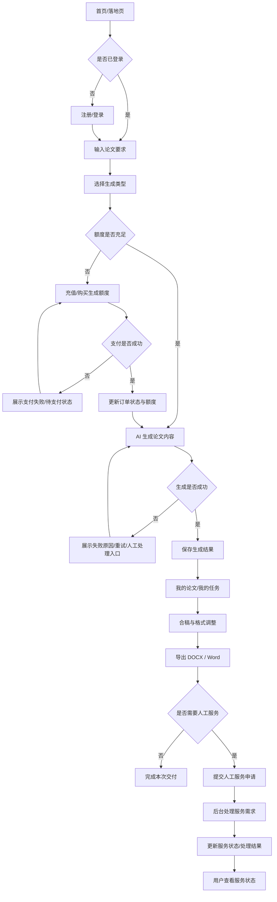

# 02 一期市场 MVP 用户流程

> 当前有效性：本文档描述一期市场发行版的唯一主流程。若旧文档中的 To B、复杂写手池、OnlyOffice 深度协同或多阶段状态机与本文冲突，以本文为准。

## 1. 主流程概览

```text
首页/落地页
→ 注册登录
→ 输入论文要求
→ 选择生成类型
→ 支付/充值
→ 生成论文内容
→ 保存生成结果
→ 合稿与格式调整
→ 导出 Word
→ 提交人工服务申请
→ 后台处理
→ 用户查看服务状态
```

## 2. Mermaid 流程图



## 3. 节点自动化程度

| 节点 | 自动化要求 | 说明 |
|---|---|---|
| 首页/落地页 | 必须自动化 | 用户可自助访问并理解产品价值。 |
| 注册/登录 | 必须自动化 | 不依赖人工开通账号。 |
| 输入论文要求 | 必须自动化 | 用户可自助输入题目、专业、字数、方向、格式要求等最小字段。 |
| 选择生成类型 | 必须自动化 | 至少支持论文初稿/大纲/开题等核心生成类型中的 MVP 范围。 |
| 支付/充值 | 必须自动化 | 必须能创建订单、完成支付状态同步和额度到账。 |
| AI 生成论文内容 | 必须自动化 | 生成是产品付费核心，不能完全依赖人工。 |
| 保存生成结果 | 必须自动化 | 生成结果必须进入用户资产，而不是一次性展示。 |
| 合稿与格式调整 | 轻量自动化 | 支持轻量编辑、整理、合并，不做复杂在线协同。 |
| DOCX / Word 导出 | 必须自动化 | 用户付费后应能获得可编辑 Word 文件。 |
| 人工服务申请 | 入口自动化，处理可人工 | 用户提交表单自动化，后续处理可人工。 |
| 后台处理 | 可以先人工处理 | 一期用后台基础处理入口承接，不做写手池。 |
| 用户查看服务状态 | 必须有状态展示 | 用户至少能看到待处理/处理中/已完成/已取消/异常。 |

## 4. 哪些节点可以先人工处理

| 节点 | 一期处理方式 | 原因 |
|---|---|---|
| 人工论文辅导服务需求评估 | 后台人工处理 | 高度非标，适合作为服务升级入口验证需求。 |
| 生成失败后的复杂补偿 | 后台人工兜底 | 一期优先保障可追踪和可处理，不先做复杂自动补偿系统。 |
| 支付/额度疑难异常 | 后台人工处理 | 需保留订单、支付、额度日志供人工核对。 |
| 用户特殊格式或导师要求 | 人工服务处理 | 不用在 MVP 内建设复杂模板市场或 OnlyOffice 协同。 |

## 5. 哪些节点必须有状态

| 状态对象 | 必须状态 | 用途 |
|---|---|---|
| 用户登录态 | 未登录 / 已登录 / 登录失效 | 控制生成、支付、个人中心访问。 |
| 订单 | 待支付 / 已支付 / 支付失败 / 已关闭 / 已退款或退款中（如已有） | 支付和额度到账依据。 |
| 额度账户 | 余额充足 / 余额不足 / 扣减中 / 扣减成功 / 扣减异常 | 防止生成与扣费不一致。 |
| 生成任务 | 待生成 / 生成中 / 生成成功 / 生成失败 / 已保存 | 用户等待和失败处理依据。 |
| 论文内容资产 | 草稿 / 已保存 / 已编辑 / 已导出 | 支撑我的论文/我的任务。 |
| 导出任务 | 待导出 / 导出中 / 导出成功 / 导出失败 | 支撑 DOCX 下载。 |
| 人工服务申请 | 待处理 / 处理中 / 已完成 / 已取消 / 异常 | 支撑后台处理和用户查看。 |

## 6. 哪些节点只需要入口

| 节点 | 一期入口要求 | 不做内容 |
|---|---|---|
| 人工服务申请 | 提交需求、上传或引用已有生成结果、查看状态。 | 不做写手抢单、复杂派单、结算。 |
| 合稿与格式调整 | 轻量编辑、章节合并、导出前整理。 | 不做多人协同、OnlyOffice 深度在线编辑。 |
| 后台处理 | 查看申请、更新状态、备注处理结果。 | 不做复杂 CRM、工单 SLA、写手绩效。 |
| 学术数据选择 | 可输入或使用轻量选项。 | 不做全国高校全量同步和复杂数据治理。 |
