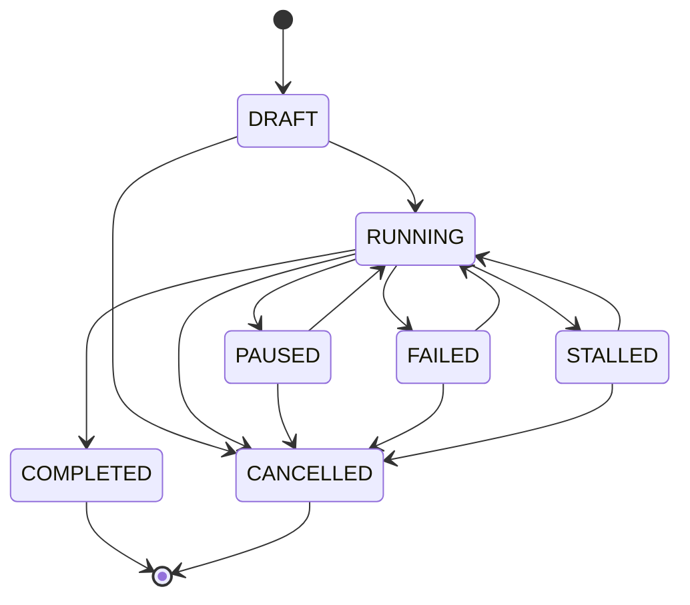

# ORD-1 后端调研（Backend Discovery）

> 范围：仅调研现有 `apps/api` 与 `prisma/schema.prisma`，不改动现有业务逻辑。

## 1) Task 实体与状态机

### 1.1 Task 数据模型（Prisma）

对应文件：`prisma/schema.prisma`（`model Task`）

| 字段 | 类型 | 可空 | 备注 |
|------|------|------|------|
| id | String | 否 | `@id @default(cuid())` |
| userId | String | 否 | 关联 `User` |
| schoolId | String | 否 | 关联 `School` |
| major | String | 否 | 专业 |
| educationLevel | String | 否 | 学历（字符串，非枚举） |
| title | String | 是 | 论文题目（可空） |
| status | TaskStatus | 否 | `@default(INIT)` |
| currentStage | TaskStage | 是 | `@default(TOPIC)` |
| requirements | String | 是 | `@db.Text` |
| totalWordCount | Int | 是 | 总字数（可空） |
| deadline | DateTime | 是 | 截止日期（可空） |
| completedAt | DateTime | 是 | 完成时间（可空） |
| createdAt | DateTime | 否 | `@default(now())` |
| updatedAt | DateTime | 否 | `@updatedAt` |

关系（部分）：
- `Task.user -> User`（`onDelete: Cascade`）
- `Task.school -> School`（`onDelete: Restrict`）
- 生成域相关：`topicCandidates/openingReports/outline/writingSessions/chapters/...`（均为一对多或一对一）

### 1.2 TaskStatus 枚举（Prisma，原文照抄）

对应文件：`prisma/schema.prisma`（`enum TaskStatus`）

```text
INIT
TOPIC_GENERATING
TOPIC_PENDING_REVIEW
TOPIC_APPROVED
OPENING_GENERATING
OPENING_PENDING_REVIEW
OPENING_APPROVED
OUTLINE_GENERATING
OUTLINE_PENDING_REVIEW
OUTLINE_APPROVED
WRITING
WRITING_PAUSED
MERGING
FORMATTING
REVIEW
REVISION
DONE
FAILED
CANCELLED
```

### 1.3 TaskStage 枚举（Prisma，原文照抄）

对应文件：`prisma/schema.prisma`（`enum TaskStage`）

```text
TOPIC
OPENING
OUTLINE
WRITING
MERGING
FORMATTING
REVIEW
REVISION
```

### 1.4 任务状态机（后端 domain 状态）

后端在 `modules/task` 内部还定义了一套“domain 状态”，用于“任务是否运行/暂停/终止”等粗粒度判断，并把 Prisma 的 `TaskStatus` 映射到该 domain 状态：

- 枚举定义：`apps/api/src/modules/task/constants/task-status.enum.ts`

```ts
export enum TaskStatus {
  DRAFT = 'DRAFT',
  RUNNING = 'RUNNING',
  PAUSED = 'PAUSED',
  COMPLETED = 'COMPLETED',
  FAILED = 'FAILED',
  CANCELLED = 'CANCELLED',
  STALLED = 'STALLED',
}
```

- 状态流转规则：`apps/api/src/modules/task/state-machine/transition-rules.ts`
- 状态机校验：`apps/api/src/modules/task/state-machine/task-state-machine.ts`
- 触发流转的服务方法：`apps/api/src/modules/task/task.service.ts`（`changeStatus()`、`startTask()`、`pauseTask()`、`resumeTask()`、`cancelTask()`、`retryTask()`、`completeTask()` 等）

#### 1.4.1 状态流转图（domain TaskStatus）



#### 1.4.2 Prisma TaskStatus ↔ domain TaskStatus 的关键映射

对应文件：`apps/api/src/modules/task/task.service.ts`

- Prisma `INIT` → domain `DRAFT`
- Prisma `DONE` → domain `COMPLETED`
- Prisma `FAILED` → domain `FAILED`
- Prisma `CANCELLED` → domain `CANCELLED`
- Prisma `WRITING_PAUSED` → domain `PAUSED`
- 其他 Prisma 状态 → domain `RUNNING`

### 1.5 生成阶段推进（GenerationStage / TaskStage）

对应文件：
- `apps/api/src/modules/task/state-machine/stage-rules.ts`（阶段顺序与可推进规则）
- `apps/api/src/modules/task/task.service.ts`（`advanceStage()`；并有 Prisma status/stage 与 GenerationStage 的互转）

后端阶段顺序（原文）：

```text
INIT -> TOPIC -> OPENING -> OUTLINE -> CHAPTER -> SECTION -> SUMMARY -> POLISHING -> DONE
```

规则：`canAdvanceTo(current, target)` 允许 `target >= current`，因此“跳过某些阶段（直接推进到更后阶段）”在代码层面是允许的；但不会记录一个单独的 `SKIPPED` 状态。

## 2) Order 实体定义与与 Task 的关系

### 2.1 Order 数据模型（Prisma）

对应文件：`prisma/schema.prisma`（`model Order`、`model OrderItem`）

核心字段（节选）：
- 订单：`id/orderNo/userId/productId/productSnapshot/amountCents/paidAmountCents/discountCents/status/channel/method/outTradeNo/transactionId/expiresAt/paidAt/completedAt/cancelledAt/refundedAt/...`
- 明细：`OrderItem(id/orderId/productName/unitPrice/quantity/subtotal/...)`

关系：
- `Order.user -> User`
- `Order.product -> Product`
- `Order.items -> OrderItem[]`
- `Order.paymentLogs -> PaymentLog[]`
- `Order.refunds -> Refund[]`
- `Order.quotaLogs -> QuotaLog[]`

### 2.2 Order 与 Task 的关系（现状结论）

现有 Prisma 模型中，`Order` 与 `Task` **没有任何外键关联**；`Task` 也没有 `orderId` 字段。

因此：
- “订单（支付/退款）”与“论文任务（生成/开题/大纲/写作）”当前是两条平行链路
- admin 的订单管理功能（`/admin/orders`）当前只能看到电商订单维度的数据

## 3) 支付相关实体（Payment / Refund）

### 3.1 PaymentLog

对应文件：`prisma/schema.prisma`（`model PaymentLog`）

- `PaymentLog` 一订单多条（`orderId` 外键）
- 记录 `type/channel/request/response/message/success/createdAt`

### 3.2 Refund

对应文件：`prisma/schema.prisma`（`model Refund`）

- `Refund` 一订单多条（`orderId` 外键）
- `RefundStatus` 枚举存在（见 schema），并在 `modules/payment` / `modules/admin/orders` 有处理逻辑
- 退款字段包括：`amountCents/reason/status/rejectReason/resolvedAt/outRefundNo/refundId/operatorId/finishedAt/errorMessage/...`

### 3.3 单笔/分笔支付结论

从 `Order` 字段形态看：
- 支付：订单级只有一组 `outTradeNo/transactionId/channel/method/paidAt/paidAmountCents`，更像“单笔支付”，但允许多条 `paymentLogs` 记录过程
- 退款：订单可有多笔退款（`Refund[]`），并有 `OrderStatus.REFUNDING/REFUNDED` 等状态流转

## 4) 关键词扫描（业务概念落点）

全局扫描关键词：`topic proposal draft revision final deposit tutor 开题 初稿 定金 指导`

存在的业务概念（对应模块）：
- `topic`：`apps/api/src/modules/topic/*`（题目生成/候选/选择）
- `opening-report`（开题）：`apps/api/src/modules/opening-report/*`
- `outline`（大纲）：`apps/api/src/modules/outline/*`
- `writing`（写作）：`apps/api/src/modules/writing/*`
- `revision`：以 `TaskStatus.REVISION`、`TaskStage.REVISION`、以及写作/润色相关重试逻辑体现

未发现的概念（代码层面缺失）：
- `deposit` / `定金`：未发现对应字段与业务逻辑
- `tutor` / `导师` / `指导`：未发现导师实体、tutorId、关联表、指派逻辑

## 5) 对 ORD-1 的直接影响（结论）

1. “论文辅导的阶段/状态”在后端已存在两层：Prisma `TaskStatus/TaskStage`（细粒度）与 domain `TaskStatus`（粗粒度运行态）
2. 订单系统目前仍是通用电商订单模型，且与 `Task` 没有关联；ORD 系列需要在不破坏现有路由/枚举的前提下逐步扩展字段与契约
3. 退款是订单域能力；论文阶段维度退款规则在后端当前无法直接推断，只能作为待确认假设进入 `02-business-rules.md`

